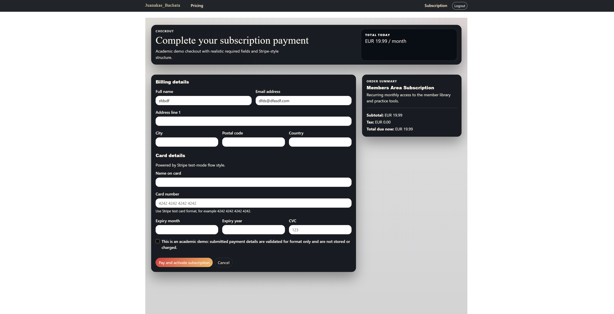

# Bachata Club - Membership Training Platform

A Django full-stack membership platform for Bachata dancers. Users can create an account, subscribe through Stripe checkout, and access members-only video lessons.

**Live Deployment:**
[https://juanakas-bachata-0d07eb997c60.herokuapp.com/home/](https://juanakas-bachata-0d07eb997c60.herokuapp.com/home/)

**GitHub Repository:**
https://github.com/Juanakas/code_institute_milestone_4

---

# 1. UX

**Project Overview:**
Bachata Club is designed for dancers who want a clear, focused learning flow. Visitors can understand the value of the platform from the homepage, create an account, subscribe, and access protected lesson content.

### Features Overview

- **Homepage Experience**: Brand-led hero section with clear calls to action.
- **Account System**: Sign up, login, logout via Django authentication.
- **Stripe Subscription Checkout**: Logged-in users can start a recurring monthly subscription.
- **Members Library**: Protected streaming of local video lessons.
- **Membership Status**: Users can view current membership status and days remaining.
- **Practice Log CRUD**: Members can create, read, update, and delete their own practice logs from the frontend.
- **Demo Payment Confirmation Flow**: In debug fallback checkout, valid form submission activates membership, shows a popup-style success message, and redirects users to the members area.
- **Responsive Interface**: Layout and controls adapted for mobile, tablet, desktop, and ultra-wide displays.

### User Experience Highlights

- Clear path from public homepage to account creation and subscription checkout.
- Protected routes ensure member content is only accessible to active memberships.
- Focused member area with embedded videos and caption tracks.
- Consistent visual language across all key pages.

### Website Preview

#### Homepage


#### Pricing Page


#### Checkout Page


#### Sign Up Page


#### Login Page


#### Subscription Status Page


#### Members Library Page


---

# 2. HTML Structure Overview

Main templates used in this project:

- **templates/base.html**: Shared layout, navbar, and message rendering.
- **templates/home/index.html**: Homepage hero and primary membership calls-to-action.
- **templates/accounts/signup.html**: Account registration page.
- **templates/registration/login.html**: Login page.
- **templates/registration/logged_out.html**: Logout confirmation page.
- **templates/subscriptions/pricing.html**: Membership pricing and subscription page.
- **templates/subscriptions/status.html**: Membership status dashboard.
- **templates/videos/member_library.html**: Protected lesson library with video players.

The templates use semantic HTML5 and Bootstrap 5 utility/layout classes with a custom design system in the main stylesheet.

---

# 3. CSS Class Reference

The project styles are in `static/css/styles.css`.

### Layout and Structure

- `.page-shell`: Shared max-width wrapper for page content.
- `.page-header`: Section header card style used across pages.
- `.panel-card`: Reusable panel container.
- `.content-columns`: Two-column responsive layout.
- `.content-side`: Sidebar column that becomes stacked on smaller screens.

### Homepage

- `.home-shell`: Main homepage wrapper.
- `.home-hero-grid`: Hero split layout for text + media.
- `.home-title`, `.home-title--hero`: Main heading styles.
- `.home-lead`: Hero description text.
- `.home-actions`: CTA button group.
- `.home-media-card`: Hero image card.

### Subscription and Membership

- `.subscriptions-page`: Page-level theme class.
- `.subscription-hero`: Main section wrapper for pricing and status pages.
- `.subscription-shell--modern`: Main subscription content container.
- `.subscription-layout`: Main content + sidebar grid.
- `.status-pill`: Membership status indicator.

### Auth Pages

- `.signup-page`, `.login-page`: Page-level visual themes.
- `.form-panel`: Shared form container style.

### Member Library

- `.member-library-shell`: Main members area wrapper.
- `.lesson-grid--simple`: Video lesson grid.
- `.member-video--full`: Responsive video player sizing.
- `.member-progress`: Progress bar beneath each video.

### Responsive Design

The stylesheet includes breakpoints for:

- Mobile phones (`<=576px`)
- Tablets (`<=768px`, `<=992px`)
- Desktop (`>992px`)
- Ultra-wide screens (`>=1800px`)
- Short-height landscape devices
- iOS safe-area handling for notch/gesture insets

---

# 4. Credits

This project was developed as part of Code Institute milestone work and adapted into a membership-based Bachata training platform.

Core technologies:

- Django
- Bootstrap 5
- WhiteNoise
- Vanilla JavaScript
- PostgreSQL-ready deployment setup

---

# 5. Testing

### HTML Validator

Recommended process:

1. Open W3C HTML Validator: https://validator.w3.org/
2. Validate core templates (`base.html`, homepage, pricing, status, login/signup, members pages).
3. Resolve any structural issues.

Current note:

- No blocking HTML structural errors were identified during local development checks.

### CSS Validator

Recommended process:

1. Open W3C CSS Validator: https://jigsaw.w3.org/css-validator/
2. Validate `static/css/styles.css`.
3. Confirm no blocking syntax errors.

Current note:

- CSS compiles and renders correctly in the tested browser set.

### Python Testing

Run all automated tests:

```powershell
python manage.py test
```

Current automated suite includes:

- `accounts/tests.py`
- `checkout/tests.py`
- `home/tests.py`
- `practice/tests.py`
- `subscriptions/tests.py`
- `videos/tests.py`

Latest result in development:

- 29 tests executed, all passing.

### Recent Updates (LO3-LO5)

- Added anonymous-only auth page behavior for logged-in users (`signup` redirect and `redirect_authenticated_user` on login).
- Hardened direct URL access around protected routes and checkout debug-only activation behavior.
- Added realistic academic checkout form with required billing/card inputs and server-side validation.
- Added purchase feedback system (rating + comments) after successful activation.
- Updated debug checkout completion flow to activate membership, show popup success messaging, and redirect directly to members area.
- Aligned deployment and security documentation with current Procfile and environment-variable usage.

### LO3 Authentication & Permissions Evidence (3.1, 3.2, 3.3)

- **3.1 Authentication mechanism with clear purpose**:
	Users can register and log in via Django auth pages to access protected member features (members library, subscription status, practice area).
	Evidence: `accounts/views.py`, `accounts/forms.py`, `templates/registration/login.html`, `templates/accounts/signup.html`.

- **3.2 Login and registration only for anonymous users**:
	Signup view redirects authenticated users away, and login view uses `redirect_authenticated_user = True`.
	Evidence: `accounts/views.py` and automated tests in `accounts/tests.py`.

- **3.3 Prevent non-admin users from direct data-store access via URL**:
	Protected routes use `@login_required`, `@subscription_required`, and object-level filtering (`user=request.user`) so users cannot change other users' records by typing URLs directly.
	Checkout dev-only activation endpoint is blocked outside debug mode.
	Evidence: `practice/views.py`, `subscriptions/decorators.py`, `checkout/views.py`, with tests in `practice/tests.py` and `checkout/tests.py`.

### LO4 E-Commerce & Purchase Feedback Evidence (4.1, 4.2)

- **4.1 Payment mechanism implemented with Stripe-oriented checkout flow**:
	The app uses Stripe Checkout when Stripe credentials are configured. For academic demonstration in debug mode, a realistic checkout form is presented with required billing and payment inputs, then subscription is activated without storing or charging card data.
	Evidence: `subscriptions/views.py`, `checkout/views.py`, `checkout/forms.py`, `templates/checkout/checkout_preview.html`.

- **4.2 Feedback system based on completed purchase**:
	After activation, users can submit checkout experience feedback (rating + comments) on the success page.
	Feedback entries are persisted and visible as recent feedback history.
	Evidence: `checkout/models.py`, `checkout/forms.py`, `checkout/views.py`, `templates/checkout/success.html`, `checkout/tests.py`.

### LO5 Version Control & Deployment Evidence (5.1-5.6)

- Deployment configuration is documented and aligned with the current production process (`Procfile`, environment variables, and deploy checklist).
- Security-related deployment settings are environment-driven (`DEBUG=0`, strong `SECRET_KEY`, HTTPS/security env vars).
- README includes setup, deployment, and test execution guidance for local and cloud-hosted runs.
- Development updates are documented incrementally in this README under testing evidence and recent updates.

### Manual Testing

| Test Case | Test Description | Expected Outcome | Result |
|-----------|------------------|------------------|--------|
| Homepage load | Open `/home/` | Hero and CTA render correctly | Pass |
| Signup flow | Open `/accounts/signup/` and submit valid data | Account created successfully | Pass |
| Login flow | Open `/accounts/login/` with valid credentials | User is logged in | Pass |
| Subscription checkout | Click subscribe on pricing page and complete checkout | Membership activated after successful checkout/webhook sync | Pass |
| Demo payment form | Open debug checkout fallback and submit with missing fields | Validation errors shown, activation blocked | Pass |
| Demo payment submit | Submit valid demo checkout form | Membership activated, popup success message shown, redirected to members area | Pass |
| Purchase feedback | Submit rating/comment after activation | Feedback saved and shown in recent feedback list | Pass |
| Membership status | Open `/subscriptions/status/` after activation | Days remaining and status shown | Pass |
| Members route protection | Access `/members/` without active membership | Redirect to pricing with warning | Pass |
| Members video rendering | Open `/members/` as active member | Embedded video players render | Pass |
| Video stream endpoint | Request `/members/video/<slug>/` as active member | MP4 response served | Pass |
| Mobile responsive | Test at 390x844 and 412x915 | No horizontal overflow, usable controls | Pass |
| Tablet responsive | Test at 768x1024 | Proper stacking and readable typography | Pass |
| Desktop responsive | Test at 1920x1080+ | Layout remains balanced and readable | Pass |

### Bugs Encountered and Fixes

| Issue # | Description | Severity | Fix Applied | Status |
|---------|-------------|----------|-------------|--------|
| 1 | Homepage required unnecessary scroll on desktop | Medium | Reduced page sections and tightened hero layout | Fixed |
| 2 | Inconsistent styling across auth/subscription pages | Medium | Unified shared page/panel typography and theme classes | Fixed |
| 3 | Members page controls included removed features | Medium | Simplified template and JS to current behavior only | Fixed |
| 4 | Payment flow previously incomplete for assessment needs | High | Added Stripe checkout session flow, webhook sync, and subscription status pages | Fixed |
| 5 | Legacy JS contained unused logic from old UI | Medium | Refactored `member-library.js` to active features only | Fixed |
| 6 | Mobile edge cases (short viewport/notch) | Medium | Added responsive safety layer and dynamic viewport/safe-area rules | Fixed |

### Browser Compatibility

| Browser | OS | Example Viewport | Result |
|---------|----|------------------|--------|
| Google Chrome | Windows | 1920x1080 | Pass |
| Microsoft Edge | Windows | 1920x1080 | Pass |
| Firefox | Windows | 1366x768 | Pass |
| Safari | iOS (target) | 390x844 | Pass |
| Chrome Mobile | Android (target) | 412x915 | Pass |

---

# 6. Video Hosting (Production)

For long-term production stability, avoid storing large MP4 files in git/slug builds.

The project supports external video hosting through an environment variable:

- `VIDEO_BASE_URL`

When `VIDEO_BASE_URL` is set, member video players use direct URLs in this format:

- `{VIDEO_BASE_URL}/{filename}`

Example Heroku config:

```powershell
heroku config:set VIDEO_BASE_URL=https://your-cdn-or-bucket.example.com/videos --app juanakas-bachata
```

Expected hosted file names:

- `20250819_beginner.mp4`
- `20251023_intermediate.mp4`
- `20251108_advanced.mp4`

After verifying playback from the external host, you can stop shipping MP4 binaries in app deployments.

#### Local development using an alternate video folder

For local development you can point the application at a different directory containing your MP4 files by setting the `VIDEO_LOCAL_DIR` environment variable to the absolute path. This is useful when you keep large video files outside the repo (for example in `videos2`). Example (PowerShell):

```powershell
$env:VIDEO_LOCAL_DIR = 'C:\Users\juanc\OneDrive\Documents\web_developer\code_institute\14_milestione4\videos2'
```

The app will prefer files from `VIDEO_LOCAL_DIR` when present; this is intended for local testing only. For Heroku/production, continue using `VIDEO_BASE_URL` or hosted CDN storage instead of `VIDEO_LOCAL_DIR`.

### Upload helper: push local videos to S3 / R2

I added `scripts/upload_videos.py` — a small Python helper that uploads `*.mp4` files from a local folder (for example `videos2`) to an S3 bucket or an S3-compatible endpoint (Cloudflare R2).

Quick steps:

1. Install the dependency:

```powershell
pip install boto3
```

2. Run the uploader (example for Cloudflare R2 with custom endpoint):

```powershell
python scripts/upload_videos.py --local-dir "videos2" --bucket my-r2-bucket \
	--provider r2 --endpoint-url https://<account_id>.r2.cloudflarestorage.com \
	--public-base-url https://<your-cf-worker-or-hosted-cdn>/videos --acl public-read
```

3. After successful uploads, set the `VIDEO_BASE_URL` on Heroku to the public base URL (without trailing slash):

```powershell
heroku config:set VIDEO_BASE_URL=https://<your-cf-worker-or-hosted-cdn>/videos --app your-app-name
```

Notes:
- The script constructs public object URLs using the provided `--public-base-url` if given. This is the recommended approach for Cloudflare R2 where you might serve files via a Worker or a CDN front.
- For AWS S3, the script will default to `https://{bucket}.s3.amazonaws.com/{prefix}/{filename}` if `--public-base-url` is omitted.
- If your bucket requires signed URLs (not public), you can skip `--public-base-url` and generate signed URLs separately.

### Accessibility Testing

Accessibility practices implemented:

- Semantic HTML structure in templates.
- Keyboard-focus-visible outlines for key interactive elements.
- Color contrast improvements in dark themed pages.
- Responsive text and layout behavior across viewports.
- Captions track included in member lesson video players.

### Performance Testing

Performance-oriented choices in the project:

- WhiteNoise compressed static files with manifest storage.
- Local static/video serving with controlled access endpoints.
- Minimal JS payload for member page interactions.
- Reused shared style system to reduce duplication.

---

# 7. Deployment

### Version Control with Git

Standard workflow:

```powershell
git status
git add .
git commit -m "Meaningful commit message"
```

### Deploying to Production (Heroku)

Prerequisites:

1. Heroku app and Heroku Postgres add-on
2. GitHub repository connected to Heroku
3. Production environment variables configured

Required environment variables:

```text
SECRET_KEY=use-a-long-random-secret-key-min-50-chars
DEBUG=0
ALLOWED_HOSTS=your-app.herokuapp.com,your-domain.com
CSRF_TRUSTED_ORIGINS=https://your-app.herokuapp.com,https://your-domain.com
DATABASE_URL=postgresql://...
SECURE_SSL_REDIRECT=1
STRIPE_PUBLIC_KEY=pk_live_or_pk_test
STRIPE_SECRET_KEY=sk_live_or_sk_test
STRIPE_WEBHOOK_SECRET=whsec_...
STRIPE_SUBSCRIPTION_PRICE_ID=price_...
```

Procfile setup in project:

```text
release: python manage.py migrate && python manage.py collectstatic --noinput
web: gunicorn --no-sendfile bachata_club.wsgi
```

Deploy checklist:

1. `python manage.py migrate`
2. `python manage.py collectstatic --noinput`
3. `python manage.py check --deploy`
4. Deploy to Heroku
5. Verify login, subscription checkout, members access, and static assets

---

# 8. User Stories

### User Story Analysis

#### User Story 1: New Visitor Wants a Clear Offer
**As a** new visitor  
**I want to** understand what the site offers quickly  
**So that** I can decide whether to create an account

Features satisfying this:

- Clear homepage branding and CTA
- Direct path to signup and pricing
- Concise explanation of monthly subscription value

#### User Story 2: Member Wants Protected Lessons
**As a** registered user  
**I want to** access members-only videos after activating my subscription  
**So that** I can train with structured content

Features satisfying this:

- Subscription checkout flow
- Membership-gated members route
- Protected lesson video endpoint

---

# 9. Purpose and Value

**For learners:**

- Fast onboarding with account + subscription checkout.
- Access to protected Bachata lesson videos.

**For platform management:**

- Simple membership lifecycle model.
- Clear app separation and maintainable templates.
- Production-ready deployment/security baseline.

---

# 10. Features

- Multi-app Django architecture (`home`, `accounts`, `videos`, `subscriptions`)
- Authentication and protected member access
- Stripe subscription checkout workflow with dev fallback form
- Members-only embedded video library and protected stream endpoint
- Subscription status dashboard
- Responsive interface tuned for phone/tablet/desktop/ultra-wide
- Deployment-ready static serving and production security settings

---

# 11. Tech Stack

- **Backend:** Python, Django
- **Database:** SQLite (development), PostgreSQL-ready via `DATABASE_URL`
- **Frontend:** HTML5, CSS3, Bootstrap 5, vanilla JavaScript
- **Server/Deploy:** Gunicorn, WhiteNoise, Heroku-ready Procfile

---

# 12. Setup

### 1) Create and activate virtual environment

```powershell
python -m venv .venv
.\.venv\Scripts\Activate.ps1
```

### 2) Install dependencies

```powershell
pip install -r requirements.txt
```

### 3) Configure environment

Create `.env` and set at minimum:

```text
SECRET_KEY=your-dev-secret
DEBUG=1
ALLOWED_HOSTS=127.0.0.1,localhost,testserver
```

### 4) Apply migrations and create superuser

```powershell
python manage.py migrate
python manage.py createsuperuser
```

### 5) Run development server

```powershell
python manage.py runserver
```

Open:

- http://127.0.0.1:8000/
- http://127.0.0.1:8000/admin/

---

# 13. Database Schema

## subscriptions.SubscriptionPlan

- `name` (CharField)
- `monthly_price` (DecimalField)
- `is_active` (BooleanField)

## subscriptions.Membership

- `user` (OneToOne to `auth.User`)
- `status` (choices)
- `current_period_end` (DateTime)
- `updated_at` (DateTime)
- Computed properties: `has_access`, `days_remaining`

## checkout.CheckoutFeedback

- `user` (ForeignKey to `auth.User`)
- `rating` (1-5 choice)
- `comments` (optional text)
- `created_at` (DateTime)

## videos.VideoLesson

- `title`, `slug`, `description`
- `level` (Beginner/Intermediate/Advanced)
- `video_url`
- `release_date`, `is_published`
- `created_at`, `updated_at`

---

# 14. URLs

Main routes:

- `/` redirect to homepage
- `/home/`
- `/accounts/signup/`
- `/accounts/login/`
- `/accounts/logout/`
- `/subscriptions/`
- `/subscriptions/status/`
- `/subscriptions/webhook/`
- `/checkout/create/`
- `/checkout/dev-complete/` (debug fallback flow)
- `/checkout/success/`
- `/members/`
- `/members/video/<slug>/`
- `/admin/`

---

# 15. CRUD Coverage

- **Create**: User account, subscription checkout session, checkout feedback entries
- **Read**: Homepage, pricing, status, members library
- **Update**: Membership/admin updates
- **Delete**: Data management via Django admin (user-facing delete not exposed in current UI)

---

# 16. Code Quality and Standards

**Python:**

- Django app separation by responsibility.
- Access control through decorators and guarded views.
- Environment-variable-based configuration.
- Production security settings enabled when `DEBUG=0`.

**Frontend:**

- Shared reusable design classes.
- Semantic template structure.
- Responsive safety layer for extreme viewport cases.

**Project standards:**

- Versioned migrations.
- Automated test coverage for key flows.
- Deployment-ready process documented.

---

# 17. Security and Authentication Notes

- Django auth handles signup/login/logout flows.
- Member content protected with `login_required` and subscription access checks.
- Production settings enforce secure cookies, HSTS, and HTTPS redirect support.
- Secret keys and deployment config loaded from environment variables.

---

# 18. Technologies Used

**Backend packages (pinned):**

- Django 6.0.2
- dj-database-url 3.1.2
- gunicorn 25.1.0
- whitenoise 6.12.0
- psycopg2-binary 2.9.11
- python-dotenv 1.2.1

**Frontend:**

- HTML5
- CSS3
- Bootstrap 5
- Vanilla JavaScript

**Infrastructure:**

- SQLite (dev)
- PostgreSQL-ready production config
- Heroku-compatible Procfile

---

# 19. Project Structure

```text
14_milestione4/
├── accounts/
├── bachata_club/
├── checkout/
├── home/
├── practice/
├── subscriptions/
├── videos/
├── templates/
│   ├── accounts/
│   ├── checkout/
│   ├── home/
│   ├── practice/
│   ├── registration/
│   ├── subscriptions/
│   └── videos/
├── static/
│   ├── css/
│   ├── js/
│   └── images/
├── manage.py
├── Procfile
├── requirements.txt
└── README.md
```

---

# 20. Future Enhancements

- Member profile page
- Lesson completion milestones
- Email reminders and onboarding sequences
- Admin analytics for engagement trends
- Optional event/workshop booking module

---

# 21. Credits and Attribution

- **Framework:** Django
- **UI foundation:** Bootstrap 5 + custom CSS
- **Static serving:** WhiteNoise
- **Deployment server:** Gunicorn
- **Project work:** Custom application logic, templates, and responsive design implemented for this project

---

# 22. License

This project is created for educational purposes as part of Code Institute coursework.

---

# 23. Contact

For questions, feedback, or collaboration, contact the maintainer through GitHub.

---

**Project developed for Milestone 4 (Full Stack Django)**
