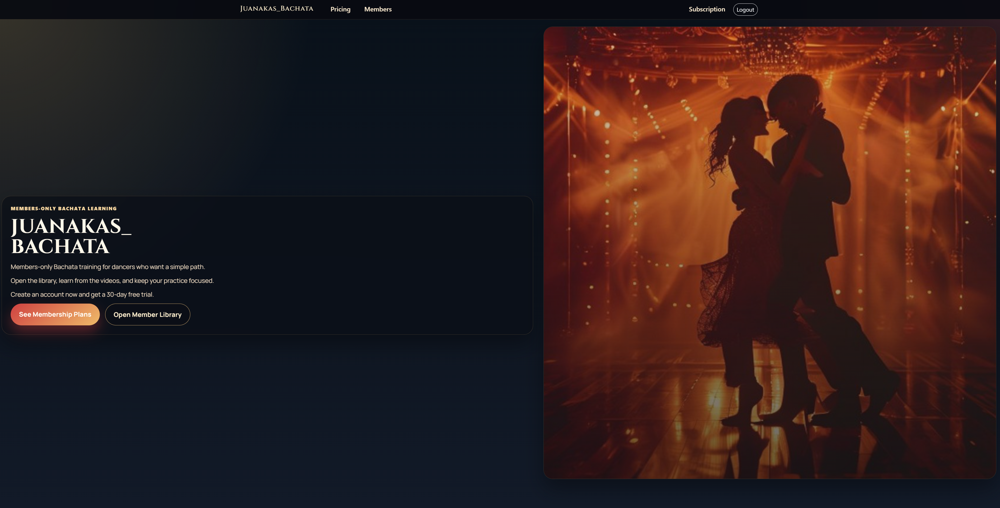
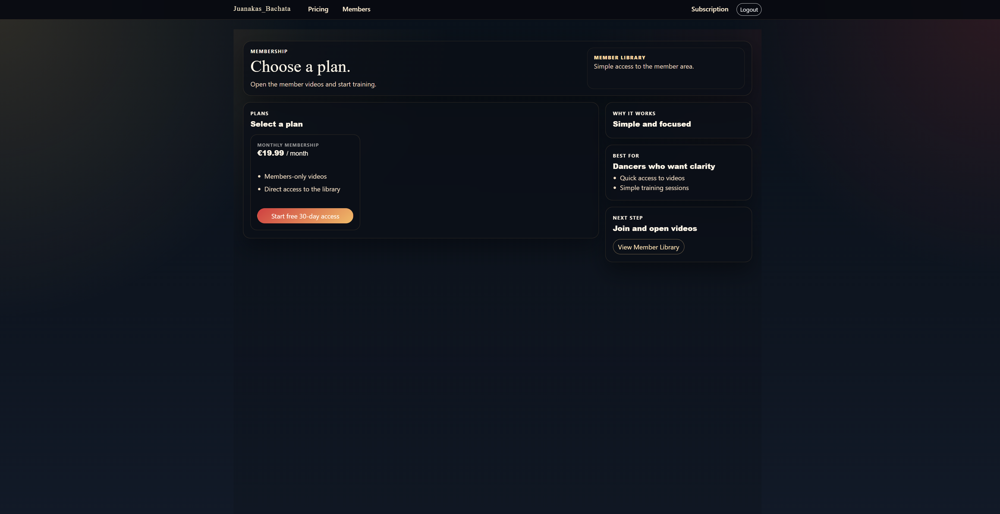
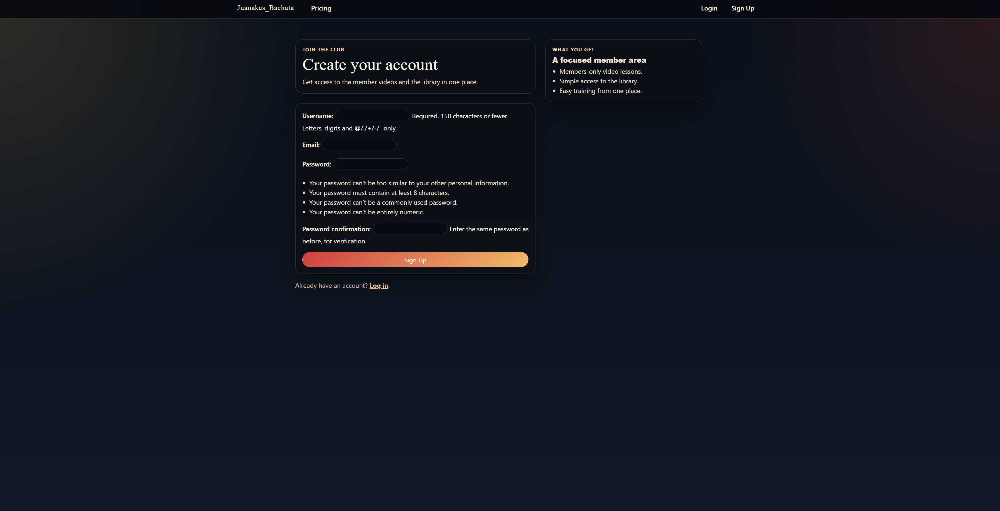
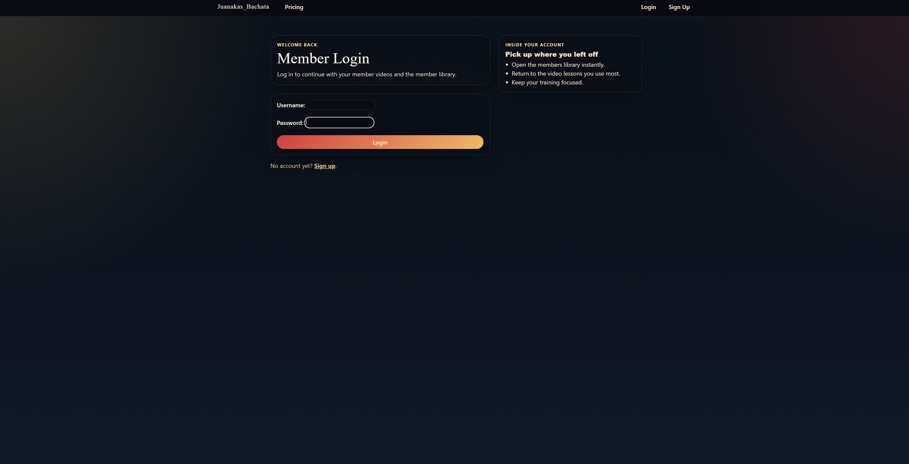
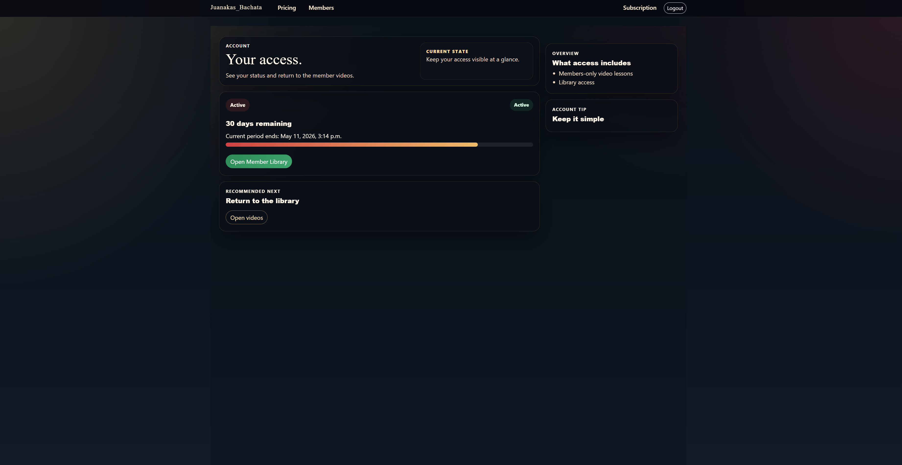
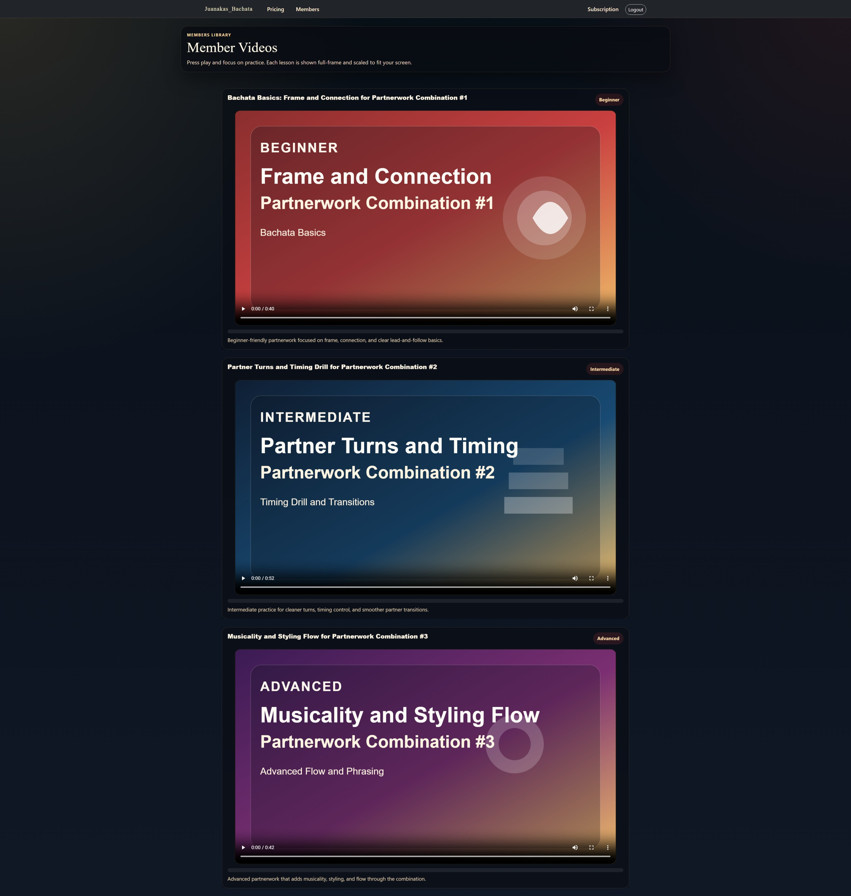

# Bachata Club - Membership Training Platform

A Django full-stack membership platform for Bachata dancers. Users can create an account, activate a free 30-day trial, and access members-only video lessons.

**Live Deployment:**
Add your live URL here

**GitHub Repository:**
https://github.com/Juanakas/code_institute_milestone_4

---

# 1. UX

**Project Overview:**
Bachata Club is designed for dancers who want a clear, focused learning flow. Visitors can understand the value of the platform from the homepage, create an account, activate a free trial, and access protected lesson content.

### Features Overview

- **Homepage Experience**: Brand-led hero section with clear calls to action.
- **Account System**: Sign up, login, logout via Django authentication.
- **Free Trial Membership**: Logged-in users can activate a 30-day free membership.
- **Members Library**: Protected streaming of local video lessons.
- **Membership Status**: Users can view current membership status and days remaining.
- **Responsive Interface**: Layout and controls adapted for mobile, tablet, desktop, and ultra-wide displays.

### User Experience Highlights

- Clear path from public homepage to account creation and trial activation.
- Protected routes ensure member content is only accessible to active memberships.
- Focused member area with embedded videos and caption tracks.
- Consistent visual language across all key pages.

### Website Preview

#### Homepage


#### Pricing Page


#### Sign Up Page


#### Login Page


#### Subscription Status Page


#### Members Library Page


---

# 2. HTML Structure Overview

Main templates used in this project:

- **templates/base.html**: Shared layout, navbar, and message rendering.
- **templates/home/index.html**: Homepage hero and primary membership calls-to-action.
- **templates/accounts/signup.html**: Account registration page.
- **templates/registration/login.html**: Login page.
- **templates/registration/logged_out.html**: Logout confirmation page.
- **templates/subscriptions/pricing.html**: Membership/trial activation page.
- **templates/subscriptions/status.html**: Membership status dashboard.
- **templates/videos/member_library.html**: Protected lesson library with video players.

The templates use semantic HTML5 and Bootstrap 5 utility/layout classes with a custom design system in the main stylesheet.

---

# 3. CSS Class Reference

The project styles are in `static/css/styles.css`.

### Layout and Structure

- `.page-shell`: Shared max-width wrapper for page content.
- `.page-header`: Section header card style used across pages.
- `.panel-card`: Reusable panel container.
- `.content-columns`: Two-column responsive layout.
- `.content-side`: Sidebar column that becomes stacked on smaller screens.

### Homepage

- `.home-shell`: Main homepage wrapper.
- `.home-hero-grid`: Hero split layout for text + media.
- `.home-title`, `.home-title--hero`: Main heading styles.
- `.home-lead`: Hero description text.
- `.home-actions`: CTA button group.
- `.home-media-card`: Hero image card.

### Subscription and Membership

- `.subscriptions-page`: Page-level theme class.
- `.subscription-hero`: Main section wrapper for pricing and status pages.
- `.subscription-shell--modern`: Main subscription content container.
- `.subscription-layout`: Main content + sidebar grid.
- `.status-pill`: Membership status indicator.

### Auth Pages

- `.signup-page`, `.login-page`: Page-level visual themes.
- `.form-panel`: Shared form container style.

### Member Library

- `.member-library-shell`: Main members area wrapper.
- `.lesson-grid--simple`: Video lesson grid.
- `.member-video--full`: Responsive video player sizing.
- `.member-progress`: Progress bar beneath each video.

### Responsive Design

The stylesheet includes breakpoints for:

- Mobile phones (`<=576px`)
- Tablets (`<=768px`, `<=992px`)
- Desktop (`>992px`)
- Ultra-wide screens (`>=1800px`)
- Short-height landscape devices
- iOS safe-area handling for notch/gesture insets

---

# 4. Credits

This project was developed as part of Code Institute milestone work and adapted into a membership-based Bachata training platform.

Core technologies:

- Django
- Bootstrap 5
- WhiteNoise
- Vanilla JavaScript
- PostgreSQL-ready deployment setup

---

# 5. Testing

### HTML Validator

Recommended process:

1. Open W3C HTML Validator: https://validator.w3.org/
2. Validate core templates (`base.html`, homepage, pricing, status, login/signup, members pages).
3. Resolve any structural issues.

Current note:

- No blocking HTML structural errors were identified during local development checks.

### CSS Validator

Recommended process:

1. Open W3C CSS Validator: https://jigsaw.w3.org/css-validator/
2. Validate `static/css/styles.css`.
3. Confirm no blocking syntax errors.

Current note:

- CSS compiles and renders correctly in the tested browser set.

### Python Testing

Run all automated tests:

```powershell
python manage.py test home subscriptions videos
```

Current automated suite includes:

- `home/tests.py`
- `subscriptions/tests.py`
- `videos/tests.py`

Latest result in development:

- 7 tests executed, all passing.

### Manual Testing

| Test Case | Test Description | Expected Outcome | Result |
|-----------|------------------|------------------|--------|
| Homepage load | Open `/home/` | Hero and CTA render correctly | Pass |
| Signup flow | Open `/accounts/signup/` and submit valid data | Account created successfully | Pass |
| Login flow | Open `/accounts/login/` with valid credentials | User is logged in | Pass |
| Trial activation | Click free trial activation on pricing page | Membership activated for 30 days | Pass |
| Membership status | Open `/subscriptions/status/` after activation | Days remaining and status shown | Pass |
| Members route protection | Access `/members/` without active membership | Redirect to pricing with warning | Pass |
| Members video rendering | Open `/members/` as active member | Embedded video players render | Pass |
| Video stream endpoint | Request `/members/video/<slug>/` as active member | MP4 response served | Pass |
| Mobile responsive | Test at 390x844 and 412x915 | No horizontal overflow, usable controls | Pass |
| Tablet responsive | Test at 768x1024 | Proper stacking and readable typography | Pass |
| Desktop responsive | Test at 1920x1080+ | Layout remains balanced and readable | Pass |

### Bugs Encountered and Fixes

| Issue # | Description | Severity | Fix Applied | Status |
|---------|-------------|----------|-------------|--------|
| 1 | Homepage required unnecessary scroll on desktop | Medium | Reduced page sections and tightened hero layout | Fixed |
| 2 | Inconsistent styling across auth/subscription pages | Medium | Unified shared page/panel typography and theme classes | Fixed |
| 3 | Members page controls included removed features | Medium | Simplified template and JS to current behavior only | Fixed |
| 4 | Stripe/payment code remained though free trial is used | High | Removed Stripe dependencies, routes, views, docs, templates | Fixed |
| 5 | Legacy JS contained unused logic from old UI | Medium | Refactored `member-library.js` to active features only | Fixed |
| 6 | Mobile edge cases (short viewport/notch) | Medium | Added responsive safety layer and dynamic viewport/safe-area rules | Fixed |

### Browser Compatibility

| Browser | OS | Example Viewport | Result |
|---------|----|------------------|--------|
| Google Chrome | Windows | 1920x1080 | Pass |
| Microsoft Edge | Windows | 1920x1080 | Pass |
| Firefox | Windows | 1366x768 | Pass |
| Safari | iOS (target) | 390x844 | Pass |
| Chrome Mobile | Android (target) | 412x915 | Pass |

### Accessibility Testing

Accessibility practices implemented:

- Semantic HTML structure in templates.
- Keyboard-focus-visible outlines for key interactive elements.
- Color contrast improvements in dark themed pages.
- Responsive text and layout behavior across viewports.
- Captions track included in member lesson video players.

### Performance Testing

Performance-oriented choices in the project:

- WhiteNoise compressed static files with manifest storage.
- Local static/video serving with controlled access endpoints.
- Minimal JS payload for member page interactions.
- Reused shared style system to reduce duplication.

---

# 6. Deployment

### Version Control with Git

Standard workflow:

```powershell
git status
git add .
git commit -m "Meaningful commit message"
```

### Deploying to Production (Heroku)

Prerequisites:

1. Heroku app and Heroku Postgres add-on
2. GitHub repository connected to Heroku
3. Production environment variables configured

Required environment variables:

```text
SECRET_KEY=your-secret-key
DEBUG=0
ALLOWED_HOSTS=your-app.herokuapp.com,your-domain.com
CSRF_TRUSTED_ORIGINS=https://your-app.herokuapp.com,https://your-domain.com
DATABASE_URL=postgresql://...
```

Procfile setup in project:

```text
release: python manage.py collectstatic --noinput
web: gunicorn bachata_club.wsgi
```

Deploy checklist:

1. `python manage.py migrate`
2. `python manage.py collectstatic --noinput`
3. `python manage.py check --deploy`
4. Deploy to Heroku
5. Verify login, trial activation, members access, and static assets

---

# 7. User Stories

### User Story Analysis

#### User Story 1: New Visitor Wants a Clear Offer
**As a** new visitor  
**I want to** understand what the site offers quickly  
**So that** I can decide whether to create an account

Features satisfying this:

- Clear homepage branding and CTA
- Direct path to signup and pricing
- Concise explanation of free 30-day trial

#### User Story 2: Member Wants Protected Lessons
**As a** registered user  
**I want to** access members-only videos after activating trial  
**So that** I can train with structured content

Features satisfying this:

- Trial activation flow
- Membership-gated members route
- Protected lesson video endpoint

---

# 8. Purpose and Value

**For learners:**

- Fast onboarding with account + free trial.
- Access to protected Bachata lesson videos.

**For platform management:**

- Simple membership lifecycle model.
- Clear app separation and maintainable templates.
- Production-ready deployment/security baseline.

---

# 9. Features

- Multi-app Django architecture (`home`, `accounts`, `videos`, `subscriptions`)
- Authentication and protected member access
- 30-day free trial activation workflow
- Members-only embedded video library and protected stream endpoint
- Subscription status dashboard
- Responsive interface tuned for phone/tablet/desktop/ultra-wide
- Deployment-ready static serving and production security settings

---

# 10. Tech Stack

- **Backend:** Python, Django
- **Database:** SQLite (development), PostgreSQL-ready via `DATABASE_URL`
- **Frontend:** HTML5, CSS3, Bootstrap 5, vanilla JavaScript
- **Server/Deploy:** Gunicorn, WhiteNoise, Heroku-ready Procfile

---

# 11. Setup

### 1) Create and activate virtual environment

```powershell
python -m venv .venv
.\.venv\Scripts\Activate.ps1
```

### 2) Install dependencies

```powershell
pip install -r requirements.txt
```

### 3) Configure environment

Create `.env` and set at minimum:

```text
SECRET_KEY=your-dev-secret
DEBUG=1
ALLOWED_HOSTS=127.0.0.1,localhost,testserver
```

### 4) Apply migrations and create superuser

```powershell
python manage.py migrate
python manage.py createsuperuser
```

### 5) Run development server

```powershell
python manage.py runserver
```

Open:

- http://127.0.0.1:8000/
- http://127.0.0.1:8000/admin/

---

# 12. Database Schema

## subscriptions.SubscriptionPlan

- `name` (CharField)
- `monthly_price` (DecimalField)
- `is_active` (BooleanField)

## subscriptions.Membership

- `user` (OneToOne to `auth.User`)
- `status` (choices)
- `current_period_end` (DateTime)
- `updated_at` (DateTime)
- Computed properties: `has_access`, `days_remaining`

## videos.VideoLesson

- `title`, `slug`, `description`
- `level` (Beginner/Intermediate/Advanced)
- `video_url`
- `release_date`, `is_published`
- `created_at`, `updated_at`

---

# 13. URLs

Main routes:

- `/` redirect to homepage
- `/home/`
- `/accounts/signup/`
- `/accounts/login/`
- `/accounts/logout/`
- `/subscriptions/`
- `/subscriptions/status/`
- `/subscriptions/activate-free/`
- `/members/`
- `/members/video/<slug>/`
- `/admin/`

---

# 14. CRUD Coverage

- **Create**: User account, free trial activation
- **Read**: Homepage, pricing, status, members library
- **Update**: Membership/admin updates
- **Delete**: Data management via Django admin (user-facing delete not exposed in current UI)

---

# 15. Code Quality and Standards

**Python:**

- Django app separation by responsibility.
- Access control through decorators and guarded views.
- Environment-variable-based configuration.
- Production security settings enabled when `DEBUG=0`.

**Frontend:**

- Shared reusable design classes.
- Semantic template structure.
- Responsive safety layer for extreme viewport cases.

**Project standards:**

- Versioned migrations.
- Automated test coverage for key flows.
- Deployment-ready process documented.

---

# 16. Security and Authentication Notes

- Django auth handles signup/login/logout flows.
- Member content protected with `login_required` and subscription access checks.
- Production settings enforce secure cookies, HSTS, and HTTPS redirect support.
- Secret keys and deployment config loaded from environment variables.

---

# 17. Technologies Used

**Backend packages (pinned):**

- Django 6.0.2
- dj-database-url 3.1.2
- gunicorn 25.1.0
- whitenoise 6.12.0
- psycopg2-binary 2.9.11
- python-dotenv 1.2.1

**Frontend:**

- HTML5
- CSS3
- Bootstrap 5
- Vanilla JavaScript

**Infrastructure:**

- SQLite (dev)
- PostgreSQL-ready production config
- Heroku-compatible Procfile

---

# 18. Project Structure

```text
14_milestione4/
├── accounts/
├── bachata_club/
├── home/
├── subscriptions/
├── videos/
├── templates/
│   ├── accounts/
│   ├── home/
│   ├── registration/
│   ├── subscriptions/
│   └── videos/
├── static/
│   ├── css/
│   ├── js/
│   └── images/
├── manage.py
├── Procfile
├── requirements.txt
└── README.md
```

---

# 19. Future Enhancements

- Member profile page
- Lesson completion milestones
- Email reminders and onboarding sequences
- Admin analytics for engagement trends
- Optional event/workshop booking module

---

# 20. Credits and Attribution

- **Framework:** Django
- **UI foundation:** Bootstrap 5 + custom CSS
- **Static serving:** WhiteNoise
- **Deployment server:** Gunicorn
- **Project work:** Custom application logic, templates, and responsive design implemented for this project

---

# 21. License

This project is created for educational purposes as part of Code Institute coursework.

---

# 22. Contact

For questions, feedback, or collaboration, contact the maintainer through GitHub.

---

**Project developed for Milestone 4 (Full Stack Django)**
